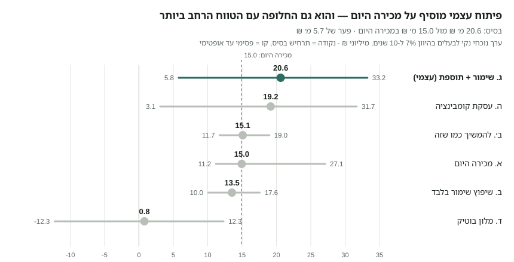
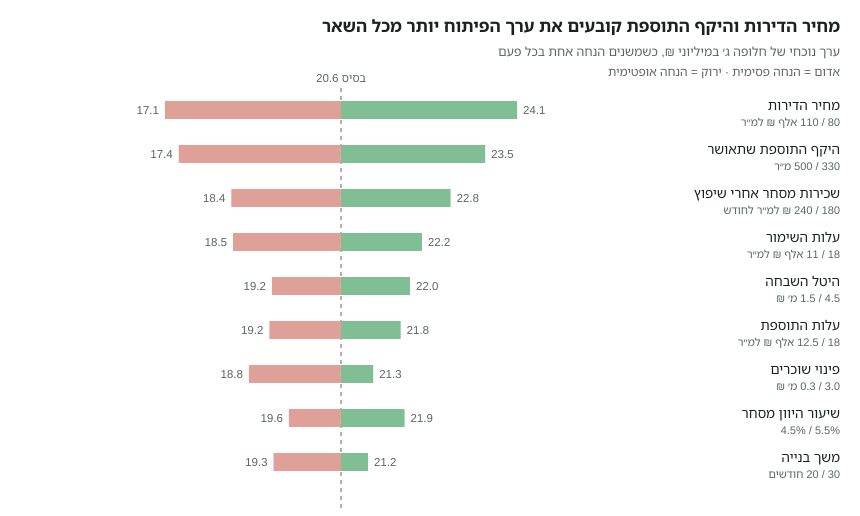
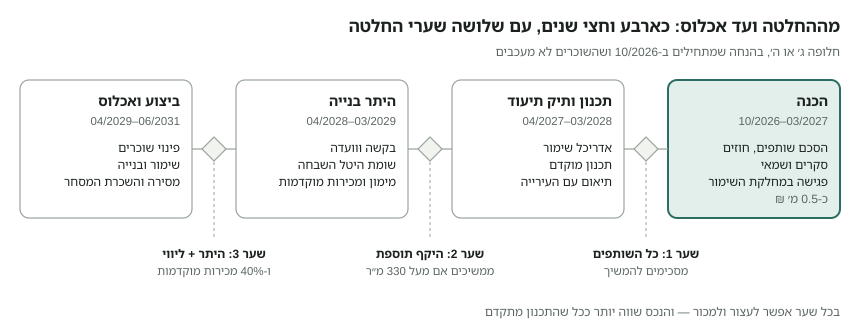

# תכנית עסקית — שבזי 58 / אחד העם 1, נווה צדק

29 בספטמבר 2026 · איתי טורן

## 1. תקציר והמלצה

**המלצה: לא למכור עכשיו.** להשקיע כשישה חודשים וכ-0.5 מ׳ ₪ בבירורים שסוגרים את שתי ההנחות הקריטיות — היקף התוספת שתאשר מחלקת השימור ומצב השוכרים והשותפים — ואז לבחור בין פיתוח עצמי לעסקת קומבינציה.

- **מה יש לנו:** בלוק שלם של 473 מ״ר בין ארבעה רחובות בנווה צדק, עם מבנה שימור בן קומה אחת (כ-475 מ״ר) שמושכר לעסקים ונמצא בבעלות משותפת.
- **מה מותר:** עד כ-993 מ״ר מעל הקרקע כולל הקיים — כלומר תוספת של עד כ-518 מ״ר בקומה ועליית גג עם גג רעפים, עד 3 קומות מרתף, ו-8 עד 12 דירות. אין איחוד חלקות ואין הריסה, אבל מותר מבנה רציף אחד על שתיהן. חניה לא נדרשת במגרש.
- **מה זה שווה (תרחיש בסיס):** מכירה היום כ-15.0 מ׳ ₪; להמשיך להשכיר 15.1; שימור + תוספת ביזמות עצמית 20.6; קומבינציה 19.2; שיפוץ בלבד 13.5; מלון 0.8.
- **המלכוד:** הפיתוח מוסיף כ-5.6 מ׳ ₪, אבל בתרחיש הפסימי הוא מפסיד כ-5 מ׳ ₪ מול מכירה, ודורש כ-5.7 מ׳ ₪ הון עצמי והסכמת כל השותפים.
- **למה קודם לברר:** שתי ההנחות שמזיזות את ההחלטה הן מחיר הדירות והיקף התוספת. את השנייה אפשר לברר בזול, והנכס שווה יותר גם למכירה אחרי שהתכנון מתקדם.

**ההחלטה הנדרשת עכשיו:** שכל השותפים יסכימו לממן יחד את שלב ההכנה (סעיף 12).

## 2. הנכס — מה יש לנו היום

שתי החלקות יחד הן בלוק עירוני שלם בן 473 מ״ר, מוקף בארבעה רחובות, ועליהן מבנה אחד בן קומה אחת שמכסה כמעט 100% מהשטח ומסומן כמבנה לשימור.

| פרט | חלקה 47 | חלקה 48 |
| --- | --- | --- |
| גוש / מגרש בתכנית 3866 | 7422 / מגרש 125 | 7422 / מגרש 126 |
| שטח רשום (לחישוב זכויות) | 236 מ״ר | 237 מ״ר |
| חזיתות לרחוב | אחד העם (9 מ׳), שבזי (7 מ׳), תחכמוני (8 מ׳) | אחד העם (9 מ׳), שבזי (7 מ׳), רבי יהודה חסיד (8 מ׳) |
| כתובות | שבזי 58, אחד העם 1, תחכמוני 9 | רבי יהודה חסיד 12 |
| ייעוד | מגורים ב׳ + חזית מסחרית מסומנת | מגורים ב׳ (חזית מסחרית לא מופיעה בדף הזכויות) |
| התראת שימור בדף הזכויות | כן — מבנה לשימור (3866) | לא מופיעה, אך פוליגון השימור ב-GIS מכסה גם אותה |

**המבנה הקיים.** לפי שכבת המבנים של העירייה: מבנה אחד (מזהה 19665), קומה אחת, טביעת רגל של כ-477 מ״ר שחוצה את קו החלקות. גובה הגג במודל הגבהים של העירייה: ממוצע 3.7 מ׳, מקסימום 5.9 מ׳. שנת הבנייה הרשומה היא 1938, ערך שכיח לבניינים ותיקים בשכונה וכנראה הערכה. רמת סיכון האסבסט בשכבה מסומנת “גבוה” — צריך סקר בשטח.

**מה רואים ב-Street View (2011–2018).** מבנה מסחרי-תעשייתי בן קומה גבוהה (כ-5.5–6 מ׳ עד ראש המעקה), טיח בהיר, חלונות רחבים במסגרות פלדה מחולקות, פילסטרים, בסיס לבנים חשופים, מעקה גג עם שיננות בפינת שבזי–רבי יהודה חסיד, ותריסי גלילה לחנויות. בחזית אחד העם פתחים כהים גדולים, אדניות ועצי רחוב.

**שימוש נוכחי.** המבנה מושכר לעסקים. ב-Google Maps מופיעים בכתובות המבנה מסעדה יפנית (שבזי 58) ובר קוקטיילים (אחד העם 1). חסר לנו: רשימת שוכרים, שטח כל יחידה, דמי שכירות, מועדי סיום חוזים והאם יש דיירות מוגנת.

**הסביבה.** כל המבנים סביב הצומת בני 1–3 קומות, רובם מסומנים לשימור (שבזי 60, שבזי 62, אחד העם 4, אחד העם 6). כ-85 מ׳ מזרחה עומד מגדל בן 29 קומות. על המדרכות סביב המבנה רשומים עצי ברכיטון עירוניים.

מקורות: דפי הזכויות של עיריית תל אביב-יפו מ-27/09/2026; שכבות ה-GIS של העירייה (חלקות, מבנים, מבנים לשימור, עצים), נשלפו ב-29/09/2026; Google Street View.

## 3. זכויות בנייה — תשובות לשאלות המנחות

על שתי החלקות יחד מותר לבנות כ-993 מ״ר מעל הקרקע (210% מהמגרש, כולל המבנה הקיים של כ-475 מ״ר), בשתי קומות ועליית גג, ובנוסף עד 3 קומות מרתף. המקור העיקרי הוא תכנית 3866 “תפרי נווה צדק צפוניים מזרחיים”, בתוקף מ-09/01/2018.

### 3.1 האם אפשר לאחד את שתי החלקות למבנה אחד?

רשמית — לא. פיזית — כן, וזה כבר המצב היום.

- סעיף 6.4.14 בתכנית אוסר איחוד חלקות. החריג היחיד הוא מגרש קטן מ-90 מ״ר, ושתי החלקות הן כ-236 מ״ר.
- מותר לבנות בקו בניין צדדי 0 בהסכמת בעלי שני המגרשים (סעיף 4.1.2ד). כלומר: נפח בנוי רציף אחד, על שתי חלקות נפרדות, עם חישוב זכויות נפרד לכל חלקה.
- התכנית אף מעודדת מרתף משותף: תנאי לחניה תת-קרקעית הוא זיקת הנאה לרמפה משותפת בין מגרשים שכנים (6.7.5).
- איחוד רשמי מחייב תכנית מפורטת חדשה שמשנה את 3866. זה הליך של שנים, בסיכוי נמוך, ואין צורך בו כדי לתכנן פרויקט אחד.

### 3.2 זכויות לפי חלקה

| נושא | הוראה | חלקה 47 (236 מ״ר) | חלקה 48 (237 מ״ר) |
| --- | --- | --- | --- |
| סה״כ מעל הקרקע (כולל עליית גג) | 210% | 495.6 מ״ר | 497.7 מ״ר |
| עיקרי — שתי קומות | 135% | 318.6 מ״ר | 320.0 מ״ר |
| עיקרי — עליית גג | 70% | 165.2 מ״ר | 165.9 מ״ר |
| שירות מעל הקרקע | 5% (ניתן להמרה לעיקרי) | 11.8 מ״ר | 11.9 מ״ר |
| עיקרי במרתף, בנוסף | 10% | 23.6 מ״ר | 23.7 מ״ר |
| תכסית | 80% (שטח פתוח ≥ 20%) | 188.8 מ״ר | 189.6 מ״ר |
| קומות מעל הקרקע | 2 (כולל קרקע) + עליית גג בגג רעפים | זהה | זהה |
| קומות מרתף | עד 3, כולל חניה, עד גבול המגרש, בכפוף למחלקת השימור (6.6.2) | זהה | זהה |
| גובה מבנה | 11.1 מ׳ כולל הגג; שיפוע הגג מתחיל עד 7.1 מ׳ | זהה | זהה |
| קווי בניין | קדמי 0 (חובה); צדדי 2.5 מ׳ או 0 בהסכמה; מרתף עד גבול המגרש | שלוש חזיתות קדמיות | שלוש חזיתות קדמיות |
| מסחר | קומת קרקע בלבד, עומק 3 מ׳ לפחות, גובה עד 3.8 מ׳ | חובה (חזית מסחרית מסומנת) | לא מסומנת — לברר |

שימושים מותרים בחזית המסחרית: מסחר קמעונאי, מסעדות, בתי קפה, גלריות, מזון עד 100 מ״ר, גני ילדים ומרפאות. הוועדה רשאית להתיר מלונאות בבניין שלם (4.1.1ד).

**הגובה הוא המגבלה האמיתית.** הקומה הקיימת גבוהה (כ-5.5 מ׳). סעיף 6.1.3 מאפשר להוסיף לגובה המותר את ההפרש בין קומה קיימת גבוהה ל-3.30 מ׳, בתנאי שהקומה הקיימת נשארת. כך מתאפשרת קומה נוספת מעל האולם הקיים ועליית גג מעליה, בגובה כולל של כ-13 מ׳.

**תכסית.** המבנה הקיים מכסה כ-100% מהמגרש, מעל ה-80% המותרים. מבנה שנבנה כדין לא יידרש להרוס שטחים עודפים (6.1.2), ובמבנים לשימור עם תכסית מעל 70% מותרת עליית גג גדולה מ-70% (5.6).

### 3.3 כמה דירות אפשר לבנות?

בין 8 ל-12 דירות, לפי מה שנעשה בקומת הקרקע. החישוב: שטח המגורים המותר חלקי שטח דירה ממוצע. שטחי מסחר לא נכנסים לחישוב, ושארית של 0.5 ומעלה מזכה בדירה נוספת.

| תרחיש | מגורים בחלקה 47 | מגורים בחלקה 48 | דירות (ממוצע 65 מ״ר) | דירות (ממוצע 70 מ״ר) |
| --- | --- | --- | --- | --- |
| מסחר בקומת הקרקע הקיימת בשתי החלקות | 256 מ״ר | 261 מ״ר | 8 (4+4) | 8 (4+4) |
| מסחר בחלקה 47 בלבד, מגורים בקרקע של 48 | 256 מ״ר | 498 מ״ר | 12 (4+8) | 11 (4+7) |

ממוצע 65 מ״ר חל על מבנים לשימור ועל מגרשים עם חזית מסחרית (4.1.2ה); ממוצע 70 מ״ר חל על תוספת לבניין קיים (6.1.4). איזה מהם גובר — לברר מול הוועדה.

### 3.4 מה גודל הדירה המינימלית?

אין מינימום לדירה בודדת; יש מינימום לממוצע: 65 מ״ר כולל עיקרי ושירות (או 70 מ״ר בתוספת לבניין קיים). אפשר לשלב דירות של 45 מ״ר עם דירות של 90 מ״ר, כל עוד הממוצע נשמר. מגורים במרתף כיחידה נפרדת אסורים (6.6.2ו). בנוסף חלה מדיניות העירייה לתמהיל גודל דירות (9065).

### 3.5 כמה חניות מותר לבנות?

בפועל — כנראה אפס חניות במגרש, וזה יתרון.

- החניות לפי התקן לא נדרשות בתוך המגרש (6.7.1). הוועדה יכולה לדרוש תשלום לקרן חניה או לפטור מבנה לשימור לגמרי (6.7.8, מדיניות 9017).
- במבנה לשימור אסורה רמפה לחניון, אלא אם קו הבניין הצדדי מעל 4 מ׳ (6.7.7). כאן המבנה מכסה את כל המגרש, ולכן רמפה לא רלוונטית.
- משבזי אסורה כניסה לחניה (מדיניות 9158, מדרג 1).
- אם בכל זאת רוצים חניה: מעלית רכב מתחכמוני או מרבי יהודה חסיד למרתף, עד התקן המרבי. בתכניות חדשות התקן המרבי הוא 0.5–0.8 לדירה (מדיניות 9130) — כלומר 4–10 מקומות. העלות גבוהה מאוד.

### 3.6 תכניות רלוונטיות בעירייה

| תכנית | מעמד | מה היא קובעת לנכס |
| --- | --- | --- |
| 3866 תפרי נווה צדק צפוניים מזרחיים | בתוקף מ-2018 | כל הזכויות, השימור, העיצוב והחניה |
| 5000 תכנית המתאר | בתוקף מ-2016 | מסגרת עירונית |
| 5500 עדכון תכנית המתאר | הופקדה ב-04/01/2026 | לא מוציאים מכוחה היתרים; כוללת מנגנוני ניוד זכויות באתרי שימור |
| 2650ב שימור מבנים | בתוקף | חל רק דרך נספח ה׳ (תמריצים, בשיקול דעת) |
| ע / ע1 מרתפים | בתוקף | מרתפים, בכפוף להוראות השימור ב-3866 |
| תמ״א 70 מטרו | בתוקף מ-2025 | “אזור שימור מקומי”: תוספות הצפיפות של המטרו לא חלות כאן |
| 3954 פרגודים | בתוקף | סוככים עונתיים למסעדות |
| תמ״א 2/4 נתב״ג, תמ״א 1 | בתוקף | מגבלת גובה וסיכון ציפורים (לא מגביל כאן); שאיבת מי תהום במרתפים |

תמ״א 38 פקעה ב-2024, ותמ״א 40 (ממ״ד) לא חלה על אתרי שימור.

## 4. שימור — מה מותר ומה אסור

המבנה מוגדר לשימור ואין להרוס אותו, אבל מותר להוסיף עליו קומה ועליית גג בתיאום עם מחלקת השימור. הוא אינו בקטגוריה המחמירה ביותר (“הגבלות מחמירות”).

### 4.1 ההגדרה

- סומן כמבנה לשימור בתכנית 3866, ולא בתכנית השימור העירונית 2650ב. לכן חל עליו סעיף 6.2.1 ב-3866.
- בשכבת השימור של העירייה הפוליגון מכסה את כל המבנה, על שתי החלקות, עם ארבע הכתובות. בדף הזכויות של חלקה 48 ההתראה לא מופיעה — זה הפער הראשון לסגור מול מחלקת השימור.
- שתי החלקות נמצאות גם ב“אזור שימור מקומי” של תמ״א 70, ולכן אין להן תוספת זכויות מכוח המטרו.

### 4.2 ההנחיות (סעיף 6.2.1)

1. תיק תיעוד מאושר על ידי מחלקת השימור הוא תנאי לכל היתר.
2. תוספת בנייה באחד משני מסלולים: לפי הזכויות של אזור הייעוד, או שימור מלא שבו מחלקת השימור קובעת את התוספת.
3. תנאי לכל תוספת: שיפוץ ושימור המבנה כולו, והסרת חלקים לא מקוריים. תעודת גמר תינתן רק אחרי שימור בפועל (6.11.7).
4. מותרת חריגה בגובה, תכסית, קווי בניין ומרתפים, אם תיק התיעוד מוכיח שכך היה במקור.
5. אלמנטי חיזוק לא יבלטו מהחזיתות. תוספת על מבנה שלא עומד בת״י 413 מחייבת חיזוק המבנה כולו (6.11.9).
6. עיצוב: טיח חלק, גג רעפי חרס בשיפוע 40%–50%, רכס מקביל לרחוב, תריסי עץ, מעקות ברזל מסורג, פתחים עד 60% מרוחב החזית.
7. במבנה לשימור הוועדה רשאית להרחיב את רשימת השימושים בהליך פרסום (4.1.1ה).

### 4.3 האם אפשר להוסיף קומות או דירות?

כן. התוספת המקסימלית היא כ-518 מ״ר מעל הקרקע (993 מותרים פחות כ-475 קיימים): קומה נוספת חלקית ועליית גג, ומתחת לקרקע מרתפים. ההיקף הסופי נקבע מול מחלקת השימור, שתבדוק נסיגות מהחזיתות המקוריות ואת נראות התוספת מהרחוב. הנחת העבודה בתכנית זו: כ-420 מ״ר תוספת ברוטו למגורים (כ-80% מהמקסימום).

אם אי אפשר להוסיף בנייה מעל הקרקע בגלל השימור, הוועדה רשאית לתת תמריצים לפי נספח ה׳ של 2650ב (שטחי מרתף, מרפסות וכו׳). זה שיקול דעת ולא זכות. ניוד זכויות למגרש אחר מיועד כיום רק למבנים עם “הגבלות מחמירות”, ולכן לא חל כאן.

### 4.4 האם אפשר להרוס?

לא, ואין לתכנן על זה.

- סעיף 6.2.1ב אוסר הריסה, למעט חלקים שתיק התיעוד מאשר (תוספות מאוחרות, סגירות לא מקוריות).
- הדרך היחידה היא תכנית חדשה שמוציאה את המבנה מרשימת השימור. בנווה צדק הסיכוי לכך נמוך מאוד, וההליך אורך שנים.
- תביעת פיצויים לפי סעיף 197 על הפגיעה בשווי: המועד הרגיל (3 שנים מאישור 3866) חלף בערך בינואר 2021. נשארת רק בקשת הארכה משר הפנים “מטעמים מיוחדים” — לבדוק עם עורך דין.

### 4.5 הטבות למבנה לשימור

- מענק מקרן השימור העירונית: עד 50,000 ₪ לכל יחידה קיימת (מגורים, מסחר, מלונאות), ולא יותר מעלות השימור. מופעל דרך “עזרה ובצרון”.
- פטור אפשרי מחניה (6.7.8).
- פרמיית שוק: פרויקטים עם רכיב שימור נמכרים לרוב ב-10%–20% מעל בנייה חדשה רגילה באותו אזור (הערכת מומחה, לא מחקר).

### 4.6 האם השימור מוסיף זכויות בנייה?

לא באחוזים. תכנית 3866 נותנת למגרש לשימור אותם 210% כמו למגרש רגיל באזור. השימור מוסיף הקלות שמאפשרות לממש את הזכויות, לא שטח נוסף:

| הקלה | מה היא נותנת כאן | סעיף |
| --- | --- | --- |
| גובה | תוספת ההפרש מעל 3.30 מ׳ של הקומה הקיימת: כ-13.1 מ׳ לרכס במקום 11.1 מ׳ | 6.1.3 |
| תכסית | הקיים (כ-100%) נשאר למרות מגבלת 80%, ועליית גג גדולה מ-70% | 6.1.2, 5.6 |
| חריגות מתועדות | גובה, תכסית, קווי בניין ומרתפים לפי המצב המקורי, אם תיק התיעוד מוכיח | 6.2.1 |
| גודל דירה | ממוצע 65 מ״ר במקום 70 מ״ר, כלומר יותר דירות מאותו שטח | 4.1.2ה |
| חניה | פטור מלא אפשרי, בלי תשלום לקרן חניה | 6.7.8 |
| שימושים | הוועדה רשאית להרחיב בהליך פרסום | 4.1.1ה |
| מענק | עד 50,000 ₪ לכל יחידה קיימת מקרן השימור | — |

מה לא חל כאן: תמריצי נספח ה׳ של 2650ב ניתנים רק כשאי אפשר לממש את הזכויות, ובשיקול דעת. ניוד זכויות חל רק על מבנים בהגבלות מחמירות. תמ״א 70 לא מוסיפה צפיפות באזור שימור מקומי.

### 4.7 תמהילי דירות

שני תמהילים בנפח של חלופה ג׳ (כ-420 מ״ר תוספת), עם גרעין מדרגות ומעלית משותף על קו החלקות. אפשר לראות את שניהם בהדמיה.

| | תמהיל א׳ | תמהיל ב׳ |
| --- | --- | --- |
| קומת קרקע, חלקה 47 | מסחר, כ-215 מ״ר | מסחר, כ-215 מ״ר |
| קומת קרקע, חלקה 48 | 2 דירות גן, כ-105 מ״ר כל אחת | מסחר, כ-215 מ״ר |
| קומה חדשה | 4 דירות, כ-62 מ״ר | 4 דירות, כ-62 מ״ר |
| עליית גג | 2 דירות, כ-75 מ״ר | 2 דירות, כ-75 מ״ר |
| סה״כ דירות | 8, ממוצע כ-76 מ״ר | 6, ממוצע כ-66 מ״ר |

8 דירות בתמהיל ב׳ מחייבות כ-520 מ״ר מגורים, כלומר את כל מעטפת הזכויות. בנפח של חלופה ג׳ הממוצע ירד אז לכ-52 מ״ר, מתחת למינימום של 65 מ״ר. לכן ההמלצה היא 6 דירות, ו-8 רק אם מחלקת השימור תאשר את המעטפת המלאה.

ל״דירות הגן״ בחלקה 48 אין כרגע גינה: המבנה מכסה את כל המגרש. חצר פרטית אפשרית רק אם תיק התיעוד יאשר פירוק של חלקים לא מקוריים.

## 5. בעלות משותפת ושוכרים — מה זה משנה בהחלטה

כל חלופה מלבד “להמשיך כמו שזה” דורשת הסכמה של כל השותפים ופינוי של השוכרים. שני אלה קובעים את לוח הזמנים יותר מכל הליך תכנוני. זה מידע כללי ולא ייעוץ משפטי.

### 5.1 שותפים (חוק המקרקעין, סעיפים 27–43)

| נושא | הכלל | משמעות לנכס |
| --- | --- | --- |
| ניהול רגיל | רוב החלקים מחליט (סעיף 30) | תחזוקה שוטפת, גבייה |
| מעבר לניהול רגיל | לפי הפסיקה — הסכמת כולם | תוספת בנייה, עסקת קומבינציה, מכירת הנכס כולו, ואולי גם חוזי שכירות ארוכים |
| מכירת חלק | כל שותף רשאי למכור את חלקו בלי הסכמה (סעיף 34) | שותף חדש עלול להיכנס באמצע התהליך |
| פירוק שיתוף | כל שותף רשאי לדרוש בכל עת (סעיף 37); נכס שלא ניתן לחלוקה נמכר (סעיף 40) | המבנה לא ניתן לחלוקה פיזית — סיכון למכירה כפויה במחיר נמוך |
| שימוש | שותף שמשתמש בנכס חייב לאחרים שכר ראוי (סעיף 33) | רלוונטי אם שותף מפעיל עסק במבנה |

הצעד הראשון הוא **הסכם שיתוף** בין כל הבעלים: מי מחליט מה, מי מממן את שלב התכנון, מה קורה כששותף רוצה לצאת (זכות סירוב ראשונה, מנגנון תמחור). בלי הסכם כזה, שותף אחד יכול לעצור כל פרויקט — או לכפות מכירה.

### 5.2 שוכרים קיימים

- **שכירות רגילה:** החוזה קובע. השאלה היא מתי מסתיימת התקופה, כולל אופציות. את לוח הזמנים של הבנייה מיישרים לתאריך הסיום המאוחר.
- **דיירות מוגנת:** חוק הגנת הדייר חל גם על בתי עסק. פינוי לצורך בנייה או תיקון יסודי מחייב היתר והצעת סידור חלוף, ובית המשפט רשאי לסרב גם כשיש עילה. בפועל סוגרים בפיצוי כספי לפי שמאות.
- **עסקים שאינם תואמים לתכנית:** סעיף 6.3.2 קובע שעסק שמהנדס העיר קבע שאינו תואם או מהווה מטרד יופסק תוך 5 שנים (כלומר מינואר 2023). לבדוק את השימוש המסחרי בחלקה 48, שאין בה חזית מסחרית מסומנת.

**מה צריך לאסוף עכשיו:** נסח טאבו עם חלקי כל בעלים, הסכמים קיימים בין השותפים, היתרי בנייה היסטוריים (תיק בניין), וכל חוזי השכירות עם שטח, דמי שכירות ותאריך סיום.

## 6. ניתוח שוק

מגורים חדשים או משופצים בנווה צדק נמכרים ב-90–100 אלף ₪ למ״ר — כפול משווי המסחר למ״ר בשוק ההשקעות. לכן עיקר הערך הנוסף נמצא בקומת המגורים שמעל המסחר, ולא במלונאות.

| נושא | נתון | מקור |
| --- | --- | --- |
| מגורים — חציון עסקאות | כ-75.8 אלף ₪ למ״ר (12 חודשים עד 08/2026, רק 12 עסקאות) | [ביזפורטל](https://www.bizportal.co.il/realestates/news/article/20038145) |
| מגורים — משופץ / חדש / יוקרה | 90–100 אלף ₪; יוקרה חדשה מעל 120 אלף | [ביזפורטל](https://www.bizportal.co.il/realestates/news/article/20038145) |
| עסקאות אחרונות | מולכו 8: 38 מ״ר ב-3.64 מ׳ ₪ (96 אלף למ״ר, 03/2026); פינס 39: 144 מ״ר ב-16 מ׳ ₪ (111 אלף, 08/2025) | [מדלן](https://www.madlan.co.il/area-info/%D7%A9%D7%9B%D7%95%D7%A0%D7%94-%D7%A0%D7%95%D7%95%D7%94-%D7%A6%D7%93%D7%A7-%D7%AA%D7%9C-%D7%90%D7%91%D7%99%D7%91-%D7%99%D7%A4%D7%95-%D7%99%D7%A9%D7%A8%D7%90%D7%9C) |
| דופלקס ברחוב שבזי | כ-150 אלף ₪ למ״ר, ירידה משיא של 170–180 אלף (03/2026) | [כלכליסט](https://www.calcalist.co.il/real-estate/article/hy0zoyefbl) |
| פרמיית שימור | 10%–20% מעל פרויקט חדש רגיל (הערכת מומחה) | [ynet](https://www.ynet.co.il/economy/article/sjp4rycngl) |
| מסחר — חנויות קטנות בשבזי | 230–340 ₪ למ״ר לחודש (מחירי מודעה, 25–30 מ״ר) | [מדלן מסחרי](https://www.madlan.co.il/commercial/for-rent/%D7%A9%D7%9B%D7%95%D7%A0%D7%94-%D7%A0%D7%95%D7%95%D7%94-%D7%A6%D7%93%D7%A7-%D7%AA%D7%9C-%D7%90%D7%91%D7%99%D7%91-%D7%99%D7%A4%D7%95-%D7%99%D7%A9%D7%A8%D7%90%D7%9C) |
| מסחר — מגמה | ירידה של 10%–20% בשכירות חנויות במרכז תל אביב בשנתיים (05/2026) | [גלובס](https://www.globes.co.il/news/article.aspx?did=1001541163) |
| מגרשים בנווה צדק | שלוש 30: כ-82 אלף ₪ למ״ר קרקע (05/2026); מגרש 178 מ״ר עם מבנה רעוע: כ-73 אלף (03/2026) | [Globes](https://en.globes.co.il/en/article-nacht-sells-two-neve-tzedek-lots-to-australians-for-nis-130m-1001543222), [Globes](https://en.globes.co.il/en/article-neve-tzedek-lot-sells-for-nis-13m-1001537539) |
| מלונאות — תפוסה בתל אביב | 51.2% ב-2025; 47.1% בינואר–יולי 2026 | [הלמ״ס](https://www.cbs.gov.il/he/mediarelease/DocLib/2025/032/28_25_032b.pdf), [ביזנס](https://bizzness.net/10-6-%D7%9E%D7%99%D7%9C%D7%99%D7%95%D7%9F-%D7%9C%D7%99%D7%A0%D7%95%D7%AA-%D7%A2%D7%A0%D7%A3-%D7%94%D7%9E%D7%9C%D7%95%D7%A0%D7%90%D7%95%D7%AA-%D7%A2%D7%93%D7%99%D7%99%D7%9F-%D7%A8%D7%97%D7%95%D7%A7/) |
| עלות בנייה נמוכה, מרכז תל אביב | 12,000 ₪ למ״ר, ללא מע״מ (06/2026) | [גלובס](https://www.globes.co.il/news/article.aspx?did=1001547976) |
| עלות שיפוץ לשימור | 15,000–25,000 ₪ למ״ר (מקור קבלני, לא רשמי) | [קבלן](https://rvsh.co.il/%D7%A2%D7%9C%D7%95%D7%AA-%D7%A9%D7%99%D7%A4%D7%95%D7%A5-%D7%91%D7%A0%D7%99%D7%99%D7%9F-%D7%9C%D7%A9%D7%99%D7%9E%D7%95%D7%A8-%D7%91%D7%AA%D7%9C-%D7%90%D7%91%D7%99%D7%91-%D7%9C%D7%9E%D7%94-%D7%96/) |
| רווח יזמי נדרש | 16% על העלות בתל אביב (תקן 21, 01/2026) | [גלובס](https://www.globes.co.il/news/article.aspx?did=1001531225) |
| ריבית | בנק ישראל 3.25% (01/09/2026); פריים 4.75% | [בנק ישראל](https://www.boi.org.il/en/communication-and-publications/press-releases/01-9-26-en/) |

שלושה דברים שלא נמצאו ומשפיעים על המודל: שכירות בפועל לחללי מסעדה גדולים בשבזי, מחיר חדר ממוצע (ADR) רשמי במלונות תל אביב, ומכירה מתועדת של מבנה מסחרי לשימור בשכונה מאז 2023. דמי השכירות שלכם הם הנתון הטוב ביותר לסעיף הראשון.

## 7. החלופות

השווינו שש דרכים להמשיך עם הנכס. בכולן מבנה השימור נשאר, והתוספת היא קומה ועליית גג של כ-420 מ״ר ברוטו (כ-80% מהמקסימום המותר).

| חלופה | מה עושים | מי מממן | משך | תנאי קריטי |
| --- | --- | --- | --- | --- |
| א. מכירה כמות שהוא | מוכרים את הנכס עם השוכרים | — | 6–12 חודשים | הסכמת כל השותפים, או פירוק שיתוף |
| ב׳. להמשיך כמו שזה | ממשיכים להשכיר, בלי עבודות | — | שוטף | תחזוקה שוטפת; המבנה מתיישן |
| ב. שיפוץ שימור בלבד | משפצים מעטפת ומערכות, משכירים מחדש במחיר גבוה יותר | הבעלים (כ-4.9 מ׳ ₪) | כשנה | השוכרים מסכימים לעבודות |
| ג. שימור + תוספת, יזמות עצמית | משפצים את המבנה, בונים 6 דירות (כ-62 מ״ר למכירה), מוכרים אותן ומשאירים לעצמנו את המסחר | הבעלים + ליווי בנקאי | 4–5 שנים | תיק תיעוד והסכמת מחלקת השימור להיקף התוספת |
| ד. מלון בוטיק | כ-18 חדרים בתוספת ובחלק מקומת הקרקע, לובי ומסעדה | הבעלים או מפעיל מלונאי | 4–5 שנים | אישור הוועדה ותקני משרד התיירות |
| ה. עסקת קומבינציה | יזם משפץ ובונה על חשבונו, מקבל את רוב הדירות; הבעלים מקבלים מבנה משופץ וחלק מהדירות | היזם | 4–5 שנים | יזם איתן וערבויות |

**וריאציה לבדיקה (ג2):** חלקה 48 מיועדת למגורים ואין בה חזית מסחרית מסומנת. הפיכת קומת הקרקע שלה לדירות לופט גבוהות תקרה מוסיפה כ-1.8 מ׳ ₪ לערך הנוכחי של חלופה ג׳ ועד 11–12 דירות בסך הכול. המחיר: פחות מסחר, ומגורים ליד ברים.

התוספת של חלופה ג׳, מעטפת הזכויות והפנים המשוער מופיעים ב[הדמיה התלת-ממדית של הנכס](index.html).

## 8. מודל פיננסי והשוואת חלופות

בתרחיש הבסיס, שימור ותוספת שווים לבעלים כ-20.6 מ׳ ₪ בערך נוכחי, מול כ-15 מ׳ ₪ במכירה היום או בהמשך השכרה. מלון ושיפוץ בלבד מורידים ערך.

הפער בין החלופות בתרחיש הבסיס קטן מהטווח של כל אחת. בתרחיש הפסימי פיתוח עצמי מפסיד כ-5 מ׳ ₪ מול מכירה; באופטימי הוא מרוויח כ-6 מ׳ ₪ יותר.

### 8.1 חלופה ג׳ — שימור + תוספת, תרחיש בסיס

| סעיף | מ׳ ₪ (ללא מע״מ) | הנחה |
| --- | --- | --- |
| הכנסות מ-6 דירות | 29.8 | 370 מ״ר למכירה × 95 אלף ₪ כולל מע״מ |
| שימור וחיזוק המבנה הקיים | −6.65 | 475 מ״ר × 14,000 ₪ |
| בניית התוספת | −6.30 | 420 מ״ר × 15,000 ₪ |
| תכנון, יועצים, פיקוח, אגרות | −2.85 | 22% מהבנייה |
| בלתי צפוי | −1.04 | 8% מהבנייה |
| היטל השבחה | −3.00 | הערכה — דרושה שומה |
| פינוי שוכרים, קרן חניה, שיווק | −1.80 | 1.0 + 0.2 + 2% מההכנסות |
| מימון | −1.24 | 5.75% על מחצית העלות לשנתיים |
| **רווח מהדירות** | **7.1** | 31% על העלות |
| שווי המסחר המשופץ שנשאר בידיכם | 18.9 | שכירות 210 ₪ למ״ר, היוון 5% (היום: 15.3) |
| הון עצמי נדרש | כ-5.7 | 25% מהעלות |

התשואה הפנימית על ההחלטה “לפתח במקום למכור” היא כ-10.9% לשנה — סבירה, אבל לא גבוהה ביחס לסיכון של פרויקט שימור.

### 8.2 מה עולה משאר החלופות

- **קומבינציה (ה):** היזם נושא גם בשימור המבנה כולו, ולכן נשאר לבעלים רק כ-11% מהדירות החדשות (כמעט דירה אחת), בנוסף למסחר משופץ. בתרחיש הפסימי יזם לא יסכים לעסקה בלי תשלום מהבעלים.
- **מלון (ד):** השקעה של כ-25.5 מ׳ ₪ מניבה EBITDA של כ-1.6 מ׳ ₪ (6.4% על העלות), פחות משיעור ההיוון המלונאי (7%). 18 חדרים הם מעט מדי לכסות קבלה, ניהול ושיווק.
- **שיפוץ בלבד (ב):** 4.9 מ׳ ₪ השקעה מוסיפים רק כ-0.18 מ׳ ₪ הכנסה נטו בשנה. כדאי רק כחלק מתוספת בנייה, או כשהמבנה מחייב תיקון.
- **מכירה היום (א):** כ-15 מ׳ ₪ בתרחיש הבסיס (היוון הכנסה וערך שייר ליזם יוצאים דומים). קונה ינכה בגלל שוכרים, שימור ושותפות, ולכן מכירה אחרי אישור תכנון שווה יותר.

## 9. רגישות וסיכונים

שתי הנחות מזיזות את התוצאה יותר מכל השאר: מחיר הדירות והיקף התוספת שמחלקת השימור תאשר. את השנייה אפשר לברר כבר עכשיו, בפגישת תיאום מקדמית, לפני שמוציאים כסף על תכנון מלא.

| סיכון | מה קורה אם הוא מתממש | איך מקטינים |
| --- | --- | --- |
| מחלוקת בין השותפים | קיפאון, או תביעת פירוק שיתוף ומכירה כפויה | הסכם שיתוף עם מנגנון הכרעה ויציאה |
| מחלקת השימור מאשרת תוספת קטנה | −3.2 מ׳ ₪ ב-330 מ״ר | אדריכל שימור + פגישה מקדמית לפני תכנון מלא |
| שוכרים מוגנים או חוזים ארוכים | עיכוב של שנים ופיצוי של מיליונים | בדיקה משפטית של כל החוזים; תכנון שלבים לפי מועדי יציאה |
| מצב קונסטרוקציה ואסבסט | חריגה בעלות השימור | סקר קונסטרוקטור וסקר אסבסט לפני תכנון |
| היטל השבחה גבוה מהצפוי | עד −1.4 מ׳ ₪ | חוות דעת שמאי מוקדמת |
| ירידת מחירים | עד −3.5 מ׳ ₪ ב-80 אלף ₪ למ״ר | מכירות מוקדמות (40%) לפני הבנייה; דירות קטנות עם ביקוש רחב |
| מגורים מעל ברים ומסעדות | מחיר נמוך יותר לדירות | הפרדה אקוסטית, כניסה נפרדת, תמהיל שוכרים שקט יותר |
| מי תהום ומרתפים | עלויות חפירה והשפלה | תכנית הבסיס ללא מרתף עמוק; מרתף רק כאפשרות |
| ריבית ומימון | עלות מימון גבוהה יותר | מינוף נמוך, מכירות מוקדמות לפני פתיחת הליווי |

## 10. מימון

פיתוח עצמי דורש כ-5.7 מ׳ ₪ הון עצמי ושעבוד של כל חלקי השותפים; קומבינציה לא דורשת הון, אבל מעבירה ליזם כמעט את כל הדירות החדשות. בשתי הדרכים הבעלים מממנים לבד את שלב ההכנה (כ-0.5 מ׳ ₪).

|  | הון עצמי + ליווי בנקאי (ג) | עסקת קומבינציה (ה) |
| --- | --- | --- |
| הון עצמי | כ-5.7 מ׳ ₪ (15%–25% מהעלות בדרישת הבנקים) | אפס, מלבד שלב ההכנה |
| עלות האשראי | פריים + 0.7% עד 1.25% (כיום 5.45%–6.0%) | על היזם |
| סיכון תכנוני וביצועי | על הבעלים | על היזם, מוגן בערבויות |
| מה נשאר בידי הבעלים (בסיס) | מסחר משופץ (18.9 מ׳ ₪) + רווח 7.1 מ׳ ₪ מהדירות | מסחר משופץ + כ-11% מהדירות |
| שליטה בתכנון ובאיכות | מלאה | לפי ההסכם עם היזם |
| תנאים מקדימים להוצאת אשראי | היתר, מכירות מוקדמות, שעבוד כל החלקים | יזם איתן, ערבויות חוק מכר וביצוע |

**דרך ביניים:** שותפות עם יזם בוטיק שמביא חלק מההון ואת הניהול, בתמורה לחלק מהרווח. כדאי לבקש הצעות בשתי התצורות מ-3–4 יזמים.

מיסוי (מידע כללי — לבדוק עם יועץ מס): מס שבח 25% על השבח הריאלי במכירה; בקומבינציה המס נמדד לפי שווי שירותי הבנייה; בפיתוח עצמי הבעלים הופכים ל“עוסקים” לעניין מע״מ (18%) ומס הכנסה. המודל מציג ערכים לפני מס.

## 11. לוח זמנים ומסלול רישוי

אם מתחילים עכשיו, המבנה המשופץ והדירות יהיו מוכנים בערך באמצע 2031. ההוצאה הגדולה מתחילה רק אחרי השער השלישי.

השלב הראשון זול וקצר, והוא זה שקובע את שתי ההנחות הקריטיות. מועד התחלת הביצוע תלוי בעיקר במועדי סיום חוזי השכירות.

## 12. צעדים מיידיים (שלב ההכנה)

עשרה צעדים, כ-0.5 מ׳ ₪ ושישה חודשים, שהופכים את ההנחות במודל לעובדות.

- [ ] לכנס את כל השותפים ולחתום על הסכם שיתוף: מנגנון החלטות, מימון שלב ההכנה, יציאה וזכות סירוב ראשונה.
- [ ] להוציא נסח טאבו עדכני לשתי החלקות ולבדוק שעבודים והערות אזהרה.
- [ ] לרכז את כל חוזי השכירות: שטח, דמי שכירות, תאריך סיום, אופציות, דיירות מוגנת.
- [ ] להזמין בעירייה תיק מידע ותיק בניין עם ההיתרים ההיסטוריים — מה נבנה כדין.
- [ ] פגישת תיאום מקדמית במחלקת השימור, עם שלוש שאלות: היקף תוספת אפשרי, מעמד השימור של חלקה 48, ושימוש קומת הקרקע של 48.
- [ ] מדידה מצבית, סקר קונסטרוקציה וסקר אסבסט.
- [ ] שמאי מקרקעין: שווי נוכחי והערכת היטל השבחה.
- [ ] עורך דין מקרקעין ויועץ מס: מבנה העסקה והשלכות מע״מ ומס שבח.
- [ ] לקבל הצעות מ-3–4 יזמי בוטיק: קומבינציה ושותפות.
- [ ] לעדכן את המודל בנתונים האמיתיים ולהחליט בשער 1.

## 13. הנחות, מקורות והסתייגויות

כל המספרים במודל הם הערכות לתכנון ראשוני. הסעיף החלש ביותר הוא דמי השכירות הנוכחיים, שלא היו בידינו.

| הנחה | פסימי | בסיס | אופטימי |
| --- | --- | --- | --- |
| שכירות מסחר היום (₪ למ״ר לחודש, 430 מ״ר) | 140 | 170 | 200 |
| שכירות אחרי שיפוץ | 180 | 210 | 240 |
| שיעור היוון מסחר | 5.5% | 5.0% | 4.5% |
| מחיר דירות (₪ למ״ר, כולל מע״מ) | 80,000 | 95,000 | 110,000 |
| תוספת מאושרת (מ״ר ברוטו) | — | 420 | — |
| עלות שימור וחיזוק (₪ למ״ר) | 18,000 | 14,000 | 11,000 |
| עלות התוספת (₪ למ״ר) | 18,000 | 15,000 | 13,000 |
| היטל השבחה (מ׳ ₪) | 4.5 | 3.0 | 1.5 |
| פינוי שוכרים (מ׳ ₪) | 3.0 | 1.0 | 0.3 |
| משך בנייה (חודשים) | 30 | 24 | 20 |
| מלון: מחיר חדר / תפוסה | 950 ₪ / 52% | 1,100 ₪ / 62% | 1,300 ₪ / 70% |

קבועים בכל התרחישים: היוון 7% לבעלים, אופק 10 שנים, צמיחת שכירות 2% בשנה, רווח יזמי 16%, עלויות רכוה 22% ובלתי צפוי 8%, 24 חודשי תכנון, מע״מ 18%. מענק שימור: 4 יחידות × 50,000 ₪.

**הסתייגות.** המסמך אינו ייעוץ משפטי, שמאי, מס או השקעות. הזכויות נקבעות סופית רק בהיתר, והמידות נלקחו משכבות GIS ואינן מחליפות מדידה.

### מקורות

- דפי זכויות של עיריית תל אביב-יפו לחלקות 47 ו-48, גוש 7422 (הופקו ב-27/09/2026): [חלקה 47](data/zchuyot/zchuyot_gush7422_helka47.pdf) · [חלקה 48](data/zchuyot/zchuyot_gush7422_helka48.pdf)
- [שכבות GIS של עיריית תל אביב](https://gisn.tel-aviv.gov.il/arcgis/rest/services/IView2/MapServer): חלקות, מבנים, מבנים לשימור, עצים, כתובות (נשלפו 29/09/2026)
- Google Maps ו-Street View (צילומים 2011, 2015, 2018)
- [תמ״א 70 — תקנון](https://www.gov.il/BlobFolder/guide/tama70_learning_environment/he/tama_70_regulations.pdf)
- [נספח ה׳ לתכנית 2650ב — מצגת העירייה](https://www.tel-aviv.gov.il/Forms/%D7%9E%D7%A6%D7%92%D7%AA%20%D7%A0%D7%99%D7%95%D7%93%20%D7%96%D7%9B%D7%95%D7%99%D7%95%D7%AA%20%D7%91%D7%A9%D7%99%D7%9E%D7%95%D7%A8%20%20-%20%D7%A0%D7%A1%D7%A4%D7%97%20%D7%94.pdf)
- [תכנית 5500 — סקירה](https://www.agmon-law.co.il/%D7%AA%D7%9B%D7%A0%D7%99%D7%AA-%D7%AA%D7%90-5500-%D7%A2%D7%93%D7%9B%D7%95%D7%9F-%D7%9C%D7%AA%D7%9B%D7%A0%D7%99%D7%AA-%D7%94%D7%9E%D7%AA%D7%90%D7%A8-%D7%A9%D7%9C-%D7%AA%D7%9C-%D7%90%D7%91%D7%99%D7%91/)
- [היטל השבחה — עיריית תל אביב](https://www.tel-aviv.gov.il/Residents/Assets/Pages/ImprovmentTax.aspx) · [פטורים — כל זכות](https://www.kolzchut.org.il/he/%D7%A4%D7%98%D7%95%D7%A8_%D7%9E%D7%94%D7%99%D7%98%D7%9C_%D7%94%D7%A9%D7%91%D7%97%D7%94)
- [קרן השימור העירונית](https://www.tel-aviv.gov.il/Residents/Development/Pages/AssistanceFunds.aspx)
- [דייר מוגן — כל זכות](https://www.kolzchut.org.il/he/%D7%93%D7%99%D7%99%D7%A8_%D7%9E%D7%95%D7%92%D7%9F_%D7%9C%D7%A4%D7%99_%D7%97%D7%95%D7%A7_%D7%94%D7%92%D7%A0%D7%AA_%D7%94%D7%93%D7%99%D7%99%D7%A8) · [פירוק שיתוף](https://addalaw.co.il/real-estate-dissolution-without-concenst/)
- [ריבית בנק ישראל, 01/09/2026](https://www.boi.org.il/en/communication-and-publications/press-releases/01-9-26-en/) · [תקן 21, רווח יזמי](https://www.globes.co.il/news/article.aspx?did=1001531225) · [קווים מנחים שמאי ממשלתי](https://www.gov.il/BlobFolder/dynamiccollectorresultitem/guideline18new/he/kavim18new.pdf)
- נתוני שוק — ראו הקישורים בטבלת סעיף 6

---

המספרים בתכנית מחושבים בקוד שבתיקייה [`model/`](model/). הגרפים נוצרים מאותו קוד (`python3 model/make_charts.py`).

